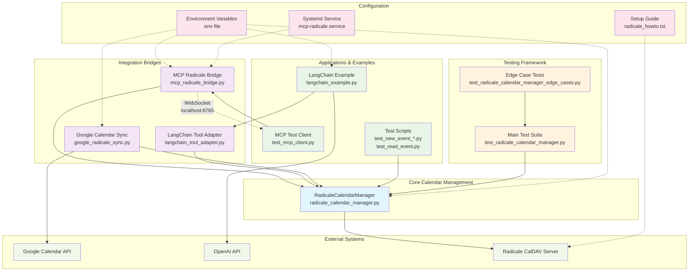

# Radicale Calendar Integration - Architecture Diagram

## System Architecture



## Component Interaction Flow

### 1. Direct Calendar Operations
```
TestScripts → RadicaleCalendarManager → Radicale Server
```

### 2. LangChain AI Calendar Assistant
```
User Query → LangChain Example → OpenAI API
           ↓
LangChain Tool Adapter → RadicaleCalendarManager → Radicale Server
```

### 3. MCP Bridge Communication
```
MCP Client → WebSocket → MCP Bridge → RadicaleCalendarManager → Radicale Server
```

### 4. Google Calendar Sync
```
Google Calendar API ↔ Google Sync ↔ RadicaleCalendarManager ↔ Radicale Server
```

## Key Integration Points

1. **RadicaleCalendarManager**: Central hub for all calendar operations
2. **Environment Configuration**: Shared across all components via .env
3. **WebSocket Protocol**: MCP Bridge communication standard
4. **LangChain Tools**: AI-powered natural language interface
5. **Testing Framework**: Comprehensive validation of all components

## Data Flow Patterns

- **Synchronous**: Direct calendar operations, testing
- **Asynchronous**: MCP WebSocket communication
- **Bi-directional**: Google Calendar synchronization
- **AI-Enhanced**: LangChain natural language processing